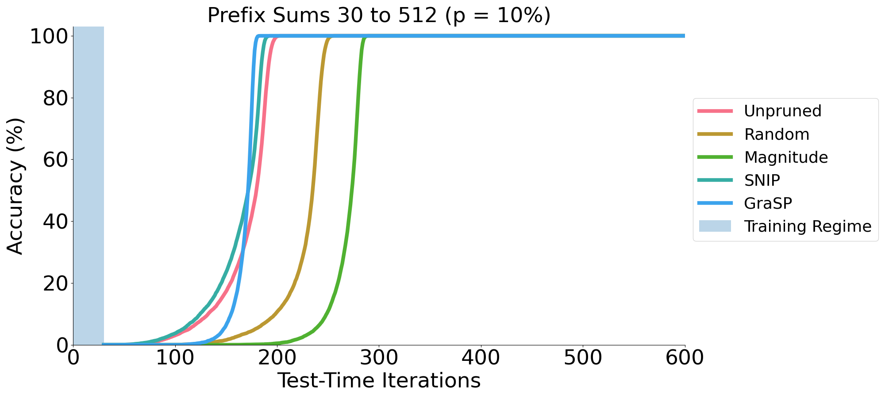
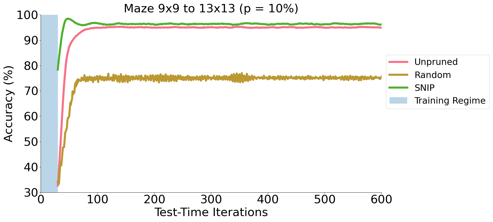

# ELEC631 Course Project

Haoran You & Tong Yu

## Evaluation of DRNs with Lottery Initialization (deep-thinking)

* Training script

```bash
CUDA_VISIBLE_DEVICES=0 python train_model.py \
problem.hyp.alpha=1 \
problem/model=dt_net_recall_1d_pruned \
problem=prefix_sums_pruned \
name=prefix_sums \
prune.ifprune=True \
prune.ratio=0.1 \
prune.method=rand (or mag or snip or grasp)
```

```bash
CUDA_VISIBLE_DEVICES=1 python train_model.py \
problem.hyp.alpha=0.01 \
problem/model=dt_net_recall_2d_pruned \
problem=mazes \
name=mazes_pruned \
prune.ifprune=True \
prune.ratio=0.1 \
prune.method=rand (or mag or snip or grasp)
```

* Test script

```bash
CUDA_VISIBLE_DEVICES=2 python test_model.py \
problem.hyp.alpha=1 \
problem/model=dt_net_recall_1d_pruned \
problem=prefix_sums \
prune.ifprune=True \
prune.ratio=0.1 \
prune.method=rand \
problem.model.model_path= PATH to Train Folder \
problem.model.test_iterations.low=30 \
problem.model.test_iterations.high=600 \
name=prefix_test_rand_0.1 \
quick_test=True
```

```bash
CUDA_VISIBLE_DEVICES=3 python test_model.py \
problem.hyp.alpha=0.01 \
problem/model=dt_net_recall_2d_pruned \
problem=mazes \
prune.ifprune=True \
prune.ratio=0.1 \
prune.method=rand \
problem.model.model_path= PATH to Train Folder \
problem.model.test_iterations.low=30 \
problem.model.test_iterations.high=1000 \
name=mazes_rand_0.1 \
quick_test=True
```

* Results





## Evaluation of DRNs' Generalizability (cifar)

* Training script

```bash
CUDA_VISIBLE_DEVICES=5 python main.py \
--save_name 'ckpt_recur' \
--iters_to_do 5
````

* Test script for CIFAR-10

```bash
CUDA_VISIBLE_DEVICES=4 python test.py \
--resume \
--resume_path './checkpoint/ckpt_recur.pth' \
--iters_to_do 10
```

* Test script for SVHN

```bash
CUDA_VISIBLE_DEVICES=4 python test_101.py \
--resume \
--resume_path './checkpoint/ckpt_recur.pth' \
--iters_to_do 5
```